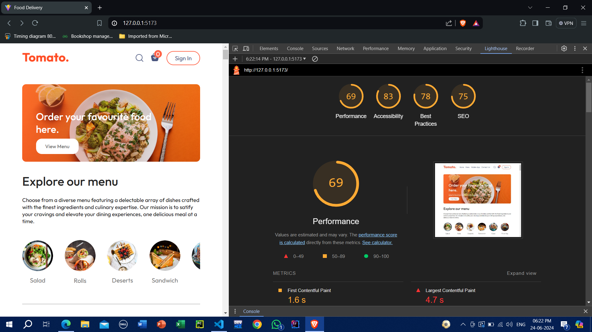
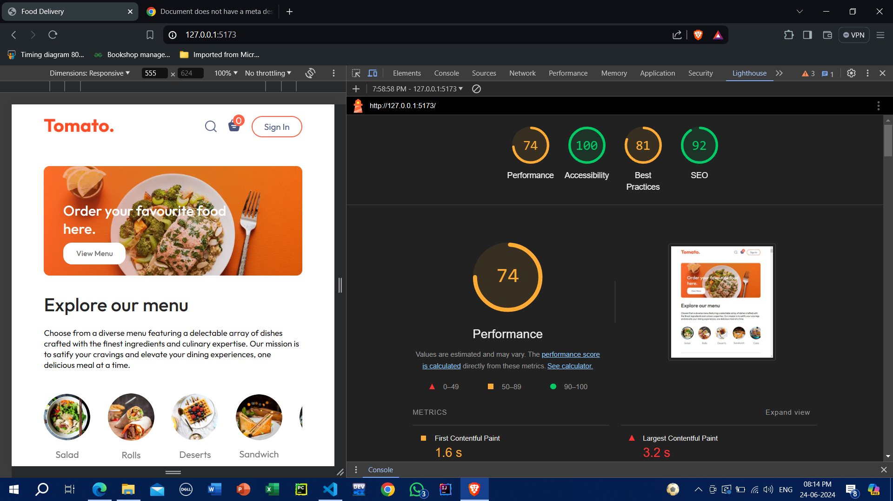

<h1>Tomato - Food Ordering Website</h1>

Tomato is a food ordering website where you can explore a diverse menu featuring a delectable array of dishes crafted with the finest ingredients and culinary expertise. Our mission is to satisfy your cravings and elevate your dining experiences, one delicious meal at a time.

<h2>Features</h2>
<ul>
    <li><strong>Order your favorite food:</strong> Browse through various categories like Salads, Rolls, Desserts, and Sandwiches.</li>
    <li><strong>User-friendly interface:</strong> Simple and intuitive design for easy navigation.</li>
    <li><strong>Accessibility:</strong> The website scores 100 on accessibility ensuring it can be used by everyone.</li>
    <li><strong>SEO optimized:</strong> The website scores 92 on SEO for better visibility on search engines.</li>
    <li><strong>Best practices:</strong> The website follows best practices with a score of 81.</li>
</ul>

<h2>Performance</h2>
<ul>
    <li><strong>Performance Score:</strong> 74</li>
    <li><strong>First Contentful Paint:</strong> 1.6 seconds</li>
    <li><strong>Largest Contentful Paint:</strong> 3.2 seconds</li>
</ul>

 <h2>Performance Optimization</h2>

We optimized the performance of our website using the Lighthouse tool. Below are the results before and after optimization:

<h3>Before Optimization</h3>
    

<h3>After Optimization</h3>
    

<h3>Procedure To Optimize:</h3>
    
We followed these steps to improve the website's performance:

<ol>
    <li>Use Webp image formaat instead of png,jpeg</li>
    <li>Minimized CSS and JavaScript files to reduce load times.</li>
    <li>Preload Big images in order to optimize the performance.</li>
    <li>Optimized images by compressing them without compromising quality.</li>
    <li>Enabled browser caching to reduce the load on the server and improve response times.</li>
    <li>Deferred loading of non-critical JavaScript to ensure that the main content is loaded first.</li>
    <li>Used lazy loading for images to only load images that are in the viewport.</li>
</ol>

<h2>Getting Started</h2>

<h3>Prerequisites</h3>
<ul>
    <li>Web browser (Chrome, Firefox, Safari, etc.)</li>
    <li>Internet connection</li>
</ul>

<h3>Installation</h3>
<ol>
    <li>Clone the repository:
        <pre><code>git clone https://github.com/your_username/tomato.git</code></pre>
        </li>
    <li>Navigate to the project directory:
            <pre><code>cd tomato</code></pre>
        </li>
    <li>Open <code>index.html</code> in your web browser to view the website.</li>
</ol>

<h2>Deployment</h2>

The website can be deployed on GitHub Pages. Follow these steps:

<ol>
    <li>Go to your repository on GitHub.</li>
    <li>Click on the "Settings" tab.</li>
    <li>Scroll down to the "GitHub Pages" section.</li>
    <li>Select the branch you want to deploy from the "Source" drop-down menu.</li>
    <li>Click "Save".</li>
</ol>

Your website will be live at <code>https://your_username.github.io/tomato</code>.

<h2>Contributing</h2>

We welcome contributions to improve the website. Please fork the repository and create a pull request with your changes.

<h2>License</h2>

This project is licensed under the MIT License

